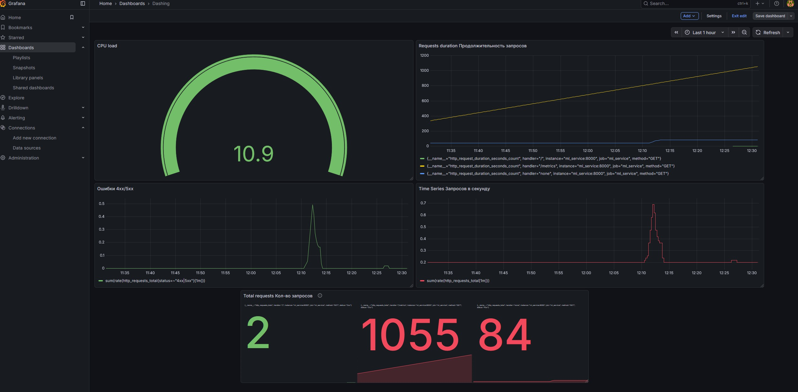

# Мониторинг ML-сервиса

FastAPI экспортирует Prometheus-метрики на `GET /metrics`. Prometheus опрашивает сервис каждые пять секунд, а Grafana автоматически загружает datasource и dashboard при старте Docker Compose.

## Слои наблюдаемости

### HTTP-слой

Метрики предоставляет `prometheus-fastapi-instrumentator`:

- `http_requests_total` — количество запросов по handler, method и status;
- `http_request_duration_seconds` — распределение времени ответа;
- `http_request_size_bytes` и `http_response_size_bytes` — размеры запросов и ответов.

### ML-слой

Метрики определены непосредственно в сервисе:

- `predict_latency_seconds` — время выполнения `model.predict`, без сетевой части;
- `model_predictions_total` — число успешно выполненных предсказаний.

HTTP latency и model latency разделены намеренно: это помогает отличить медленный инференс от накладных расходов API.

### Process-слой

Стандартный Prometheus client экспортирует:

- `process_cpu_seconds_total`;
- `process_resident_memory_bytes`;
- метрики Python garbage collector.

## Основные PromQL-запросы

RPS:

```promql
sum(rate(http_requests_total[5m]))
```

Доля ответов 4xx/5xx:

```promql
sum(rate(http_requests_total{status=~"4xx|5xx"}[5m]))
/
clamp_min(sum(rate(http_requests_total[5m])), 0.001)
```

P95 общей HTTP latency:

```promql
histogram_quantile(
  0.95,
  sum(rate(http_request_duration_seconds_bucket[5m])) by (le)
)
```

P95 чистого времени инференса:

```promql
histogram_quantile(
  0.95,
  sum(rate(predict_latency_seconds_bucket[5m])) by (le)
)
```

Средняя загрузка одного CPU core за минуту:

```promql
rate(process_cpu_seconds_total[1m]) * 100
```

Скорость успешных предсказаний:

```promql
rate(model_predictions_total[5m])
```

## Dashboard

Dashboard содержит пять обзорных панелей:

1. CPU usage — rate, а не накопительный CPU counter;
2. API p95 latency;
3. 4xx/5xx error rate;
4. requests per second;
5. total requests.

Файл: [`dashboard.json`](dashboard.json).



## Интерпретация сигналов

- растут HTTP latency и inference latency — вероятна проблема модели или CPU;
- растёт HTTP latency при стабильной inference latency — проверять middleware, сеть и контейнер;
- растёт доля 4xx — изменился клиентский payload или контракт признаков;
- растёт доля 5xx — проверять model artifact и runtime dependencies;
- `up{job="ml_service"} == 0` — Prometheus не может получить метрики;
- RPS есть, но `model_predictions_total` не растёт — запросы не доходят до успешного инференса.

## Базовые алерты

Пороговые значения ниже являются стартовыми и должны уточняться после наблюдения за реальной нагрузкой:

- `up{job="ml_service"} == 0` дольше одной минуты;
- доля 5xx выше 2% в течение пяти минут;
- p95 HTTP latency выше 500 ms в течение десяти минут;
- p95 inference latency выше 300 ms в течение десяти минут;
- отсутствие успешных предсказаний при ненулевом RPS;
- устойчивое потребление CPU выше 80% одного core.

## Что пока не измеряется

Техническая доступность не гарантирует качество ML-модели. Для production-контура дополнительно нужны:

- drift входных признаков;
- распределение предсказаний;
- доля неизвестных/некорректных категорий;
- online business metric;
- версия модели в каждом ответе или trace;
- сравнение online-данных с reference dataset.

## Проверка контура

```bash
curl --fail http://127.0.0.1:8002/service-status
curl --fail http://127.0.0.1:8002/metrics
curl --fail "http://127.0.0.1:9090/api/v1/query?query=up%7Bjob%3D%22ml_service%22%7D"
```

Для генерации трафика:

```bash
cd services
python load_test.py --requests 40 --delay 0.25
```
